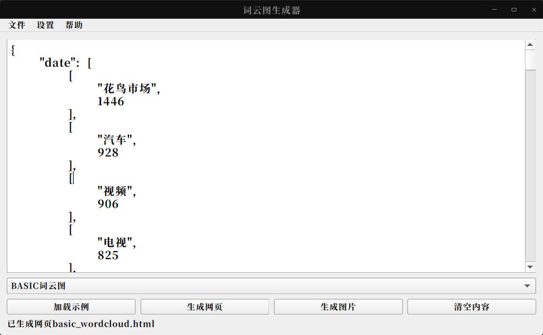
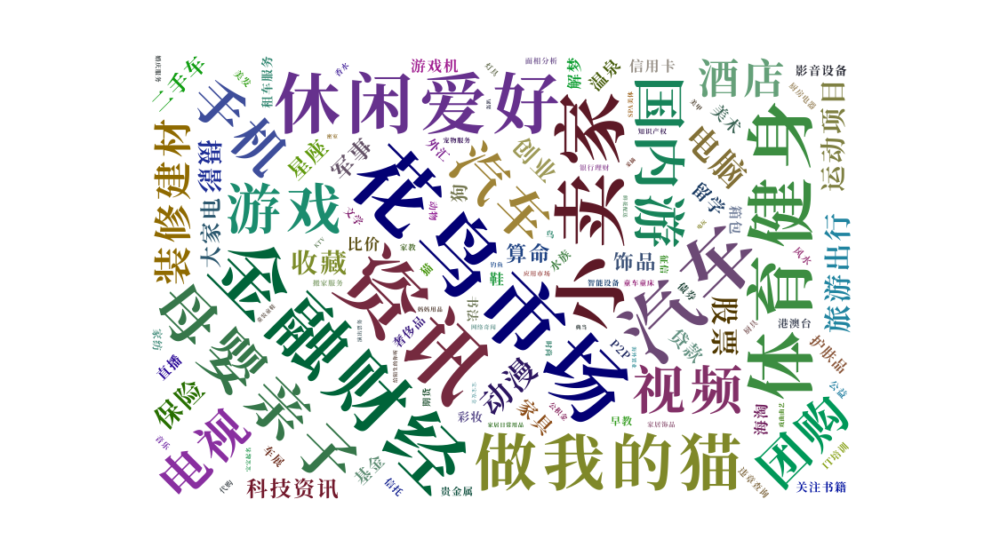

# WordCloudWindow

##### 简介

- 词云图生成器：一键生成不同类型的词云图。
- 支持生成Basic类型，Diamond类型和自定义图片类型的词云图。
- 当前版本仅支持生成html文件，需要图片可以打开html文件，右键保存为图片。

##### 运行

> 推荐使用创建venv环境运行

1. [pyecharts](https://pyecharts.org/#/zh-cn/basic_charts?id=wordcloud%ef%bc%9a%e8%af%8d%e4%ba%91%e5%9b%be) 文档
2. [pyqt5](https://www.pythonguis.com/) 文档

##### 程序截图

##### 词云图

[示例](example/example.html)

##### 如何导出为图片？

文档： [渲染图片](https://pyecharts.org/#/zh-cn/render_images)

1. [snapshot-selenium](https://github.com/pyecharts/snapshot-selenium) 是 pyecharts + selenium 渲染图片的扩展，使用 selenium 需要配置 browser driver，这部分可以参考 [selenium-python](https://selenium-python.readthedocs.io/installation.html#drivers) 相关介绍，推荐使用 Chrome 浏览器，可以开启 headless 模式。目前支持 Chrome, Safari。
2. [snapshot-phantomjs](https://github.com/pyecharts/snapshot-phantomjs) 是 pyecharts + phantomjs 渲染图片的扩展，需要先安装 phantomjs，安装方法请参照官网 [phantomjs.org/download.html](http://phantomjs.org/download.html)
3. [snapshot-pyppeteer](https://github.com/pyecharts/snapshot-pyppeteer) 是 pyecharts + pyppeteer 渲染图片的扩展，需要先安装 pyppeteer 和 Chromium 安装方法请参照仓库地址 [snapshot-pyppeteer](https://github.com/pyecharts/snapshot-pyppeteer)

>  第一种使用selenium，如果是chrome浏览器，需要找到对应版本的chromedriver，比较麻烦，未做尝试。
>
> 第二种使用phantomjs，按照官网安装，尝试了，但是生成的图片空白。
>
> 第三种未作尝试。

